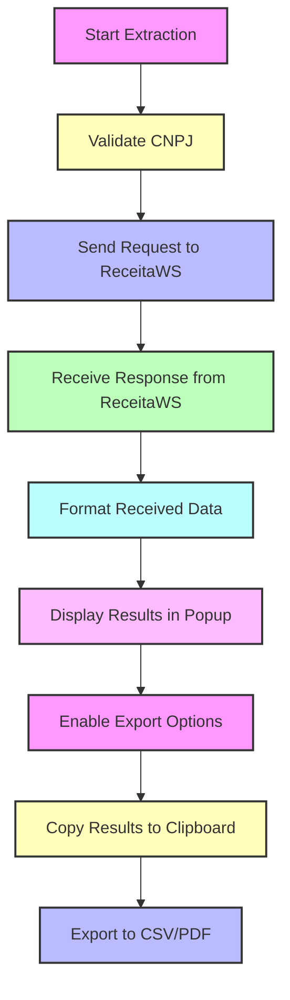

<p align="center">
  
</p>

# EchoMEI


## Overview

**EchoMEI** is a Chrome extension designed to streamline the process of extracting and managing MEI data from the Brazilian Federal Revenue Service. This tool facilitates the automatic retrieval, display, and export of CNPJ data directly within the browser.


## Features

-   **CNPJ Validation**: Ensures valid CNPJ formats.
-   **Data Extraction**: Automatically fetch and display MEI data.
-   **Export Options**: Export data to CSV and PDF formats.
-   **Clipboard Integration**: Copy results to the clipboard.
-   **Notifications**: Receive notifications for various actions.
-   **Persistent Storage**: Store extraction results locally.



## Installation

### Prerequisites

-   Google Chrome browser
-   Node.js and npm for development

### Steps

1. **Clone the repository**

    ```bash
    git clone https://github.com/takk8is/EchoMEI.git
    cd EchoMEI
    ```

2. **Load the extension in Chrome**

    - Open Chrome and navigate to `chrome://extensions/`
    - Enable "Developer mode"
    - Click on "Load unpacked" and select the `EchoMEI` directory

3. **Build the project (optional)**
   If you want to make changes and build the project:
    ```bash
    npm install
    npm run build
    ```

## Usage

1. **Open the EchoMEI popup**

    - Click on the EchoMEI icon in the Chrome toolbar.

2. **Enter CNPJs**

    - Paste or type the CNPJs into the input area, each on a new line.

3. **Extract Data**

    - Click the "Buscar" button to start the extraction process.

4. **View Results**
    - The results will be displayed in the popup. You can copy the results to the clipboard or export them to CSV or PDF.

## Code Overview

### `manifest.json`

Defines the extension's metadata, permissions, and entry points.

### `popup.js`

Handles the user interactions in the popup, including starting the extraction process, displaying results, and handling exports.

### `background.js`

Manages the background tasks of the extension, including processing CNPJs, communicating with the browser's tabs, and storing results.

### `content.js`

Executes scripts within the context of the loaded web pages to facilitate data extraction.

### `popup.html`

The HTML structure of the extension's popup interface.

## Development

### Project Structure

```
EchoMEI/
├── AUTHORS.md
├── LICENSE.md
├── PRIVACY.md
├── README.md
├── background.js
├── content.js
├── css
│   └── materialize.min.css
├── images
│   ├── icon1024.png
│   ├── icon128.png
│   ├── icon144.png
│   ├── icon192.png
│   ├── icon48.png
│   ├── icon512.png
│   ├── icon72.png
│   ├── icon96.png
│   └── screenshot.png
├── manifest.json
├── popup.html
└── popup.js
```

### Scripts

-   **Start extraction**

    ```javascript
    chrome.runtime.sendMessage({
        action: "startExtraction",
        cnpjs: cnpjs,

    ```

-   **Display results**

    ```javascript
    function displayResults(results) {
        results.forEach((result) => {
            const { cnpj, razaoSocial, anoCalendario } = result;

    ```

## Contributing

We welcome contributions! Please follow these steps:

1. Fork the repository.
2. Create your feature branch (`git checkout -b feature/AmazingFeature`).
3. Commit your changes (`git commit -m 'Add some AmazingFeature'`).
4. Push to the branch (`git push origin feature/AmazingFeature`).
5. Open a Pull Request.

## License

This project is licensed under the Creative Commons Attribution 4.0 International License. See the [LICENSE](LICENSE) file for more details.

## Support

If you have any questions or need support, please open an issue on [GitHub](https://github.com/takk8is/EchoMEI/issues).

## Donate

Support the project with USDT (TRC-20):

```
TGpiWetnYK2VQpxNGPR27D9vfM6Mei5vNA
```

Feel free to adjust any sections to better fit the specific needs or style preferences of your repository.

## About Takk™ Innovate Studio

Leading the Digital Revolution as the Pioneering 100% Artificial Intelligence Team.

-   Copyright (c) Takk™ Innovate Studio
-   Author: David C Cavalcante
-   Email: say@takk.ag
-   LinkedIn: https://www.linkedin.com/in/hellodav/
-   Medium: https://medium.com/@davcavalcante/
-   Website: https://takk.ag/
-   Twitter: https://twitter.com/takk8is/
-   Medium: https://takk8is.medium.com/
